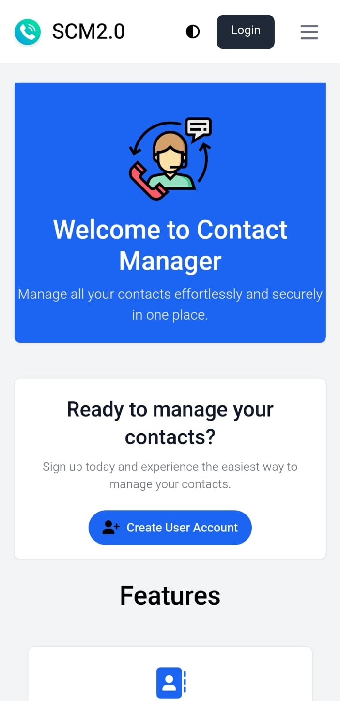
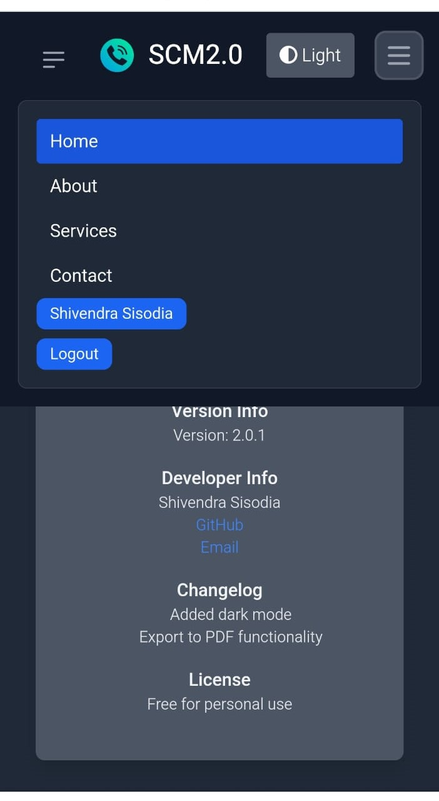

# SCM 2.0 - Smart Contact Manager

SCM 2.0 is an advanced Java-based application designed to efficiently manage contact information. Built using Spring Boot, Hibernate, and a responsive frontend, this project ensures a seamless user experience for personal and professional contact management.

---

## 🌟 Features

- **User Authentication:** Secure login and registration system with password encryption.
- **CRUD Operations:** Create, Read, Update, and Delete contacts effortlessly.
- **Search and Filter:** Easily find contacts with advanced search and filter options.
- **Pagination and Sorting:** User-friendly navigation through large contact lists.
- **Profile Management:** Update user profile details, including profile pictures.
- **Responsive Design:** Optimized for desktops, tablets, and mobile devices.
- **Role-Based Access Control:** Admin and user-specific functionalities.
- **Custom Error Handling:** Detailed error pages for better user guidance.

---

## 🛠️ Technology Stack

- **Frontend:** HTML5, CSS3, Bootstrap 5, Thymeleaf
- **Backend:** Java 17, Spring Boot 3, Hibernate ORM
- **Database:** MySQL
- **Security:** Spring Security (with BCrypt password encoding)
- **Build Tool:** Maven
- **IDE:** IntelliJ IDEA, Eclipse
- **Version Control:** Git, GitHub

---

## 🚀 Getting Started

### Prerequisites

- Java Development Kit (JDK 17 or higher)
- Maven (latest version)
- MySQL Database
- Git

### Installation

1. **Clone the repository:**
   ```bash
   git clone https://github.com/Shivendra-Digital/SCM2.0-Smart-Contact-Manager.git
   ```

2. **Navigate to the project directory:**
   ```bash
   cd SCM2.0-Smart-Contact-Manager
   ```

3. **Build the project:**
   ```bash
   mvn clean install
   ```

4. **Set up the database:**
   - Create a database named `scm2` in MySQL.
   - Update `application.properties` with your database credentials:
     ```properties
     spring.datasource.url=jdbc:mysql://localhost:3306/scm2
     spring.datasource.username=your_username
     spring.datasource.password=your_password
     spring.jpa.hibernate.ddl-auto=update
     spring.jpa.show-sql=true
     ```

5. **Run the application:**
   ```bash
   mvn spring-boot:run
   ```

6. **Access the application:**
   Open your browser and go to: [http://localhost:8080](http://localhost:8080)

---

## 📸 Screenshots

### Home Page


### Sidebar


### Navbar


### Dashboard
.jpg)

### Sweetalert
.jpg)

---

## 📂 Project Structure

```
SCM2.0-Smart-Contact-Manager
├── src
│   ├── main
│   │   ├── java
│   │   │   └── com.example.scm
│   │   │       ├── controllers
│   │   │       ├── entities
│   │   │       ├── repositories
│   │   │       ├── services
│   │   ├── resources
│   │       ├── templates
│   │       │   ├── login.html
│   │       │   ├── dashboard.html
│   │       │   ├── add_contact.html
│   │       │   ├── contact_list.html
│   │       │   └── profile.html
│   │       ├── static
│   │           ├── css
│   │           └── js
│   └── test
├── pom.xml
└── README.md
```

---

## 📋 Contributing

Contributions are welcome! Follow these steps to contribute:

1. Fork the repository.
2. Create a new branch for your feature or bug fix.
3. Commit your changes with clear messages.
4. Push your branch and create a pull request.

---

## 🤝 Contact

For any questions or feedback, feel free to reach out:

- **Email:** [sisodiashivendra66@gmail.com](mailto:sisodiashivendra66@gmail.com)
- **GitHub:** [Shivendra Sisodia](https://github.com/Shivendrasis)
- **LinkedIn:** [Shivendra Sisodia](https://www.linkedin.com/in/shivendra-sisodia-222b98204)

---

## 📜 License

This project is licensed under the MIT License. See the [LICENSE](LICENSE) file for details.

---

## 🔗 Links

- **Project Repository:** [SCM 2.0 GitHub](https://github.com/Shivendra-Digital/SCM2.0-Smart-Contact-Manager)
- **Documentation:** Coming Soon
